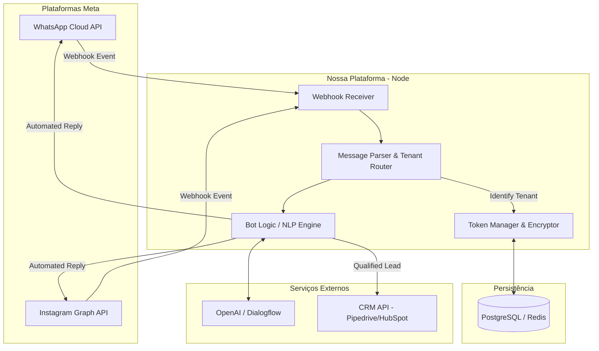
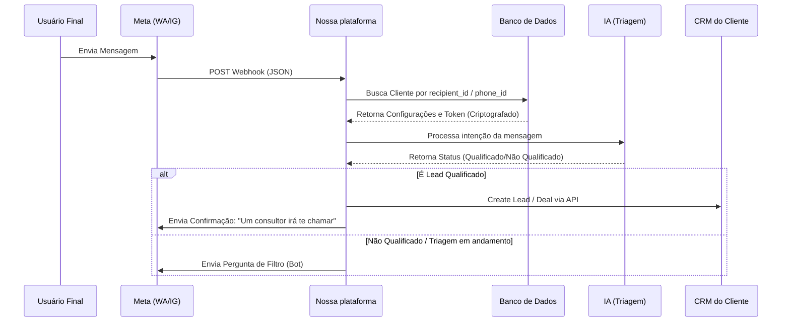
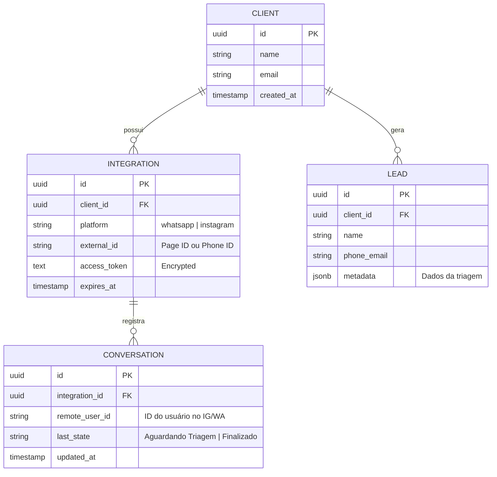

# Plataforma de respostas

Um dos grandes gargalos dos clientes que começam a fazer tráfego pago é a capacidade de responder o volume de mensagens recebidas devido ao aumento de interações que o tráfego pago gera. Pensando nisso, esta plataforma tem o objetivo de automatizar o contato inicial com estes clientes afim de captar e filtrar os clientes de acordo com sua intenção.

## Desenho técnico inicial

### Fluxo de API

### Fluxo de recebimento de mensagens

### Estrutura de dados:

